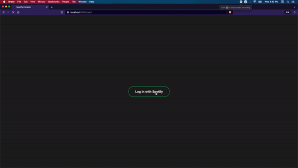

# Spotify Console

> This project fetches user specific data from Spotify after they login using the Spotify Oauth

### Instructions
 - Install all the dependencies from the `requirements.txt` file\
 `pip install -r requirements.txt`
 - cd into **spotify** folder and run `python manage.py runserver`
 - In the browser url bar type "http://127.0.0.1:8000/user/"
 - It uses Spotify's OAuth and I do not store any of your data hence  
no need to worry about data privacy. :)

### Goal
The goal of this project was to learn Django as well as CSS. Below are the few  
conceptual learnings gained through this project.
- function views
- writing callback function
- handling static files
- handling templates
- creating custom filters to be used in the HTML templates
- Jinja2
- models
- storing different data types in models like text, number, datetime, JSON
- querying model to get anonymous data
- page redirects

### Demonstration
